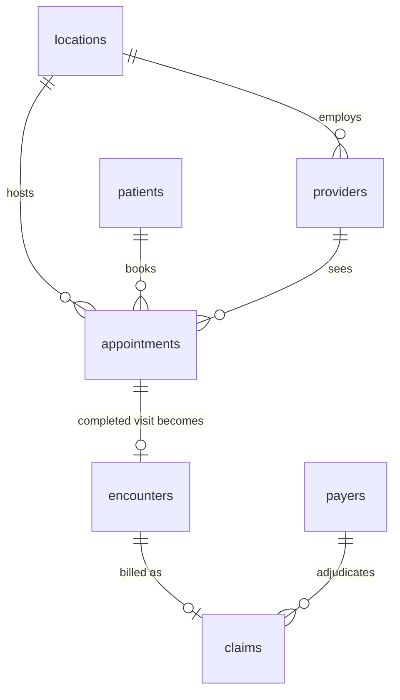

# caremetrics-source

A synthetic healthcare operational database in PostgreSQL.
It is the **source system** of the CareMetrics analytics engineering portfolio project:

```
operational Postgres  ->  Airbyte  ->  BigQuery (raw)  ->  dbt  ->  Looker Studio
   (this repo)
```

It models the day-to-day records of a fictional multi-clinic outpatient practice: patients, providers, clinics, payers, appointments, encounters and insurance claims.
The data is normalized, internally consistent and deliberately operational (OLTP) in shape.
There are no dimensions, facts or marts here; building those is the job of the downstream pipeline.

> **All data is synthetic.**
> Names come from Faker, dates are generated, and every payer and organization name is invented.
> The database contains no real PHI.

## Quick start

Requirements: Docker (with Compose) and Python 3.12 or newer (developed on 3.14).

```bash
git clone <repo-url> caremetrics-source
cd caremetrics-source

cp .env.example .env

docker compose up -d                 # PostgreSQL 18 on localhost:5433

python3 -m venv .venv
source .venv/bin/activate
pip install -r requirements.txt

python -m caremetrics.migrate        # create the schema
python -m caremetrics.seed           # load the synthetic dataset (~5 seconds)

docker compose exec -T postgres psql -U caremetrics -d caremetrics < sql/verify_data.sql
```

The last command should end with `All 18 data checks passed.` and a table of row counts.

## Commands

All commands run from the repository root with the virtualenv active.

| Command | What it does |
|---|---|
| `python -m caremetrics.db` | Check connectivity and print server details. |
| `python -m caremetrics.migrate` | Apply pending SQL migrations from `migrations/`. |
| `python -m caremetrics.seed` | Load the full dataset into an empty database. |
| `python -m caremetrics.seed --reset` | Delete all data, then reload it. |
| `python -m caremetrics.seed.<table>` | Preview one generator (for example `caremetrics.seed.claims`): seeds it and its dependencies inside a transaction, prints summaries and sanity checks, then rolls back. |
| `psql ... < sql/verify_data.sql` | Read-only checks of the seeded data. Exits non-zero on failure. |
| `psql ... < sql/schema_smoke_test.sql` | Proves the schema rejects invalid rows. Runs in a rolled-back transaction. |

For the two SQL scripts against the local container, use `docker compose exec -T postgres psql -U caremetrics -d caremetrics < <file>`.
Against any other database, use `psql "$DATABASE_URL" -f <file>`.

## Configuration

Settings live in `.env`, copied from `.env.example`.
Variables already set in the real environment take precedence over `.env`.

| Variable | Used by | Purpose |
|---|---|---|
| `POSTGRES_USER`, `POSTGRES_PASSWORD`, `POSTGRES_DB` | Docker Compose | Credentials of the local container. |
| `POSTGRES_PORT` | Docker Compose | Host port for the container (default `5433`, avoiding a local Postgres on `5432`). |
| `DATABASE_URL` | Python scripts | The only connection setting the code reads. |
| `SEED_RANDOM_SEED` | Seeder | Seed for every random stream. |
| `SEED_ANCHOR_DATE` | Seeder | The generator's "today" (`YYYY-MM-DD`). |

If you change the `POSTGRES_*` values, update `DATABASE_URL` to match.

## Data model



| Table | Rows | Notes |
|---|---:|---|
| `locations` | 5 | Clinics of "Larkspur Health" along Colorado's Front Range. One opens in April 2025, inside the history window. |
| `payers` | 10 | Fictional plans: `commercial`, `medicare`, `medicaid`, `other_government`. |
| `providers` | 50 | Ten specialties. `created_at` is the hire date; departed providers have `active = false` and `updated_at` = departure date. |
| `patients` | 10,000 | Synthetic demographics, mostly Colorado residents. |
| `appointments` | 75,000 | `scheduled`, `completed`, `cancelled`, `no_show`. `created_at` is the booking time. |
| `encounters` | ~50,600 | Exactly one per completed appointment. |
| `claims` | ~45,900 | At most one per encounter. `pending`, `submitted`, `accepted`, `denied`, `paid`. |

Conventions:

* Primary keys are UUIDv7: time-ordered, so new rows append to the end of the index.
* Every table has `created_at` and `updated_at` (`timestamptz`, stored in UTC).
  A trigger sets `updated_at` on every `UPDATE`.
* Status-like columns are `text` with `CHECK` constraints rather than `ENUM` types, so they are easy to evolve and replicate as plain strings.
* Money is `numeric(12, 2)`.

### Rules the schema enforces

* An encounter's patient, provider and location must match its appointment, and a claim's patient and provider must match its encounter.
  Composite foreign keys enforce this, so a mismatched row cannot be stored.
* At most one encounter per appointment and one claim per encounter.
* `submitted_at` is null exactly when a claim is `pending`.
* `amount_paid` is positive exactly when a claim is `paid`, and never exceeds `amount_billed`.
* A patient cannot be born after their record was created; `updated_at` never precedes `created_at`.

### Rules the verification script checks

Some rules compare rows across tables, which a `CHECK` constraint cannot express.
`sql/verify_data.sql` checks them instead, for example:

* encounters exist only for completed appointments, and every completed appointment has one
* claims are created and submitted after their encounter completed
* appointments happen at the provider's clinic, after the clinic opened, while the provider was employed
* pediatrics only sees patients under 18 and OB/GYN only sees female patients
* no timestamps lie in the future

## What the data looks like

* **Time span.**
  Appointments cover about two years of history before the anchor date (default `2026-10-01`) plus about 60 days of future bookings.
  Patient and provider records go back to 2019.
* **Growth and seasonality.**
  Volume grows as the patient base grows, the new clinic ramps up from its opening, winters are busier and midsummer is quieter.
  Clinics are closed on Sundays and major US holidays.
* **Realistic appointment outcomes.**
  About 67% of appointments are completed, 19% cancelled, 8% no-shows and 5% still scheduled.
  No-shows are more common for Medicaid and uninsured patients.
* **Coherent patient histories.**
  Patients usually see the same provider again, a first visit with a specialty is `new_patient` and later ones are not, and annual wellness visits happen about once a year.
* **Payer behavior.**
  Uninsured patients produce no claims.
  Payers differ in denial rate, share of billed charges paid and time to payment, so those patterns can be discovered downstream.
* **A live billing pipeline.**
  Older claims are resolved (paid or denied) while recent weeks still show pending, submitted and accepted claims.
* **Change history for incremental sync.**
  Some patient records and encounter charts are edited after creation, and statuses change over time, so `updated_at` differs from `created_at` on many rows.

## How generation works

The seeder lives in `caremetrics/seed/`, one module per table.
Each module has a pure `generate()` that builds Python objects, a `seed()` that bulk-loads them with `COPY`, and a preview `main()`.

* **Reproducible.**
  The same `SEED_RANDOM_SEED` and `SEED_ANCHOR_DATE` produce identical data, including IDs.
  Nothing reads the wall clock, and each table draws from its own named random stream, so changing one generator does not shift the values of the others.
  Faker is pinned to an exact version because its output can change between releases.
* **Deterministic UUIDv7.**
  IDs are built from each row's own `created_at` plus seeded random bits.
  They look exactly like IDs the application would have generated at that moment, and the seeder knows every key before inserting, so parent and child tables stream through `COPY` without reading IDs back.
* **Generator-only behavior.**
  Specialty profiles (eligible ages, visit mix, typical length and charge), payer profiles (denial rate, reimbursement, turnaround) and patient attributes (home clinic, insurance, visit frequency) drive the simulation but are not stored as columns.
  They surface only as patterns in the data, as they would in a real system.
* **All or nothing.**
  `python -m caremetrics.seed` runs in a single transaction, including the `--reset` truncation, so a failed run never leaves a half-seeded database.

## Migrations

`migrations/` holds plain SQL files named `NNN_description.sql`.
`python -m caremetrics.migrate` applies pending files in order, each in its own transaction, and records them in `schema_migrations` with a SHA-256 checksum.

* Editing an already-applied migration is reported as an error.
  Make schema changes in a new file.
* An advisory lock prevents two runners from migrating at the same time.

| Migration | Contents |
|---|---|
| `001_initial_schema.sql` | Tables, constraints and `updated_at` triggers. |
| `002_source_indexes.sql` | Foreign key indexes, operational query indexes and `updated_at` indexes for incremental sync. |

## Project layout

```
.
├── caremetrics/
│   ├── db.py              # connection helper and streaming COPY
│   ├── migrate.py         # migration runner
│   └── seed/
│       ├── __main__.py    # python -m caremetrics.seed
│       ├── config.py      # settings, named random streams, UUIDv7
│       ├── locations.py   payers.py   providers.py   patients.py
│       └── appointments.py   encounters.py   claims.py
├── migrations/            # plain SQL, applied in order
├── sql/
│   ├── schema_smoke_test.sql
│   └── verify_data.sql
├── docker-compose.yml
├── requirements.txt
└── .env.example
```

## Connecting a SQL client

With the default `.env`, any Postgres client (Postico, DBeaver, psql) connects with:

| Setting | Value |
|---|---|
| Host | `localhost` |
| Port | `5433` |
| Database | `caremetrics` |
| User | `caremetrics` |
| Password | `caremetrics_local_dev` |
| SSL | off |

## Using a hosted database (Neon)

Nothing in the code is specific to the local container.
To load the same dataset into Neon or any other Postgres 18 database:

```bash
export DATABASE_URL="postgresql://<user>:<password>@<host>/<db>?sslmode=require"

python -m caremetrics.migrate
python -m caremetrics.seed
psql "$DATABASE_URL" -f sql/verify_data.sql
```

`python -m caremetrics.seed` refuses to run against a database that already holds data; pass `--reset` only when you intend to replace it.

## Notes for Airbyte

* Every table has a single-column UUID primary key.
* `updated_at` is a reliable incremental cursor: the trigger sets it on every update, and the large tables have an index on it.
  The three small reference tables (`locations`, `payers`, `providers`) are cheap to sync in full.
* The seeded data has no hard deletes: provider departures and cancellations are updates, which incremental sync picks up.

## Out of scope for this phase

* Ongoing data changes after the initial seed (a mutation script to exercise incremental sync and dbt snapshots).
* Claim resubmissions and corrections, multiple claims per encounter, line items and diagnosis or procedure codes.
* Patients changing insurance over time.
